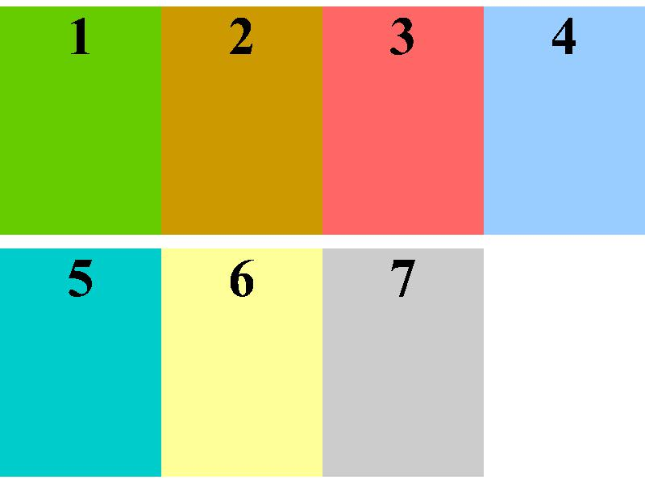
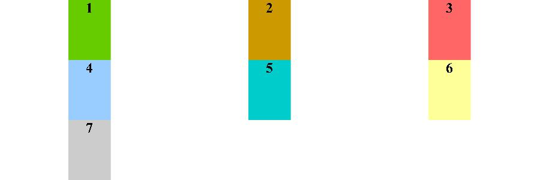
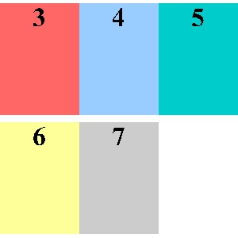

# pdfpreview

Simple tool to generate thumbnails from PDF. It renders pages from input PDF beginning with `first page` to `last page` (inclusive) into one image. Pages are fitted into size specified as `box width` x `box height` and placed next to each other. Up to `box max x` pages can be placed in one row.

See [make-samples.sh](samples/make-samples.sh) or examples section for usage examples and their results.


#### Dependencies

* `g++`
* `pkg-config`
* `libpoppler44` (maybe other versions will work, tested on 0.24.5 and 0.29.0)
* `libpoppler-dev` 

#### Compiling

Run `./build.sh` in directory with pdfpreview to compile it.

#### Usage

PDF file is read from `stdin` and thumbnail image is written to `stdout`. Errors and messages will appear in `stderr`.
```
pdfpreview <box width> <box height> <box max x> [first page] [last page] [verbose]
```

* **box width**, **box height** - Size of box in pixels, must be positive integer.
* **box max x** - Number of pages to place in one row, must be positive integer.
* **first page** - Optional, first page number to render. Pages are numbered from 1, which is default value.
* **last page** - Optional, last page number to render, inclusive. Defaults to number of pages in the document.
* **verbose** - Optional, prints usefull info to `stderr`. Use 1 to enable, 0 to disable (default)

#### Examples

All examples are generated from [this PDF](samples/sample.pdf)

`pdfpreview 100 150 2`


`pdfpreview 100 150 4`



`pdfpreview 150 100 3`



`pdfpreview 100 150 3 3 7`



`pdfpreview 100 150 1 5 5`


#### License

Licensed under GPL v2
